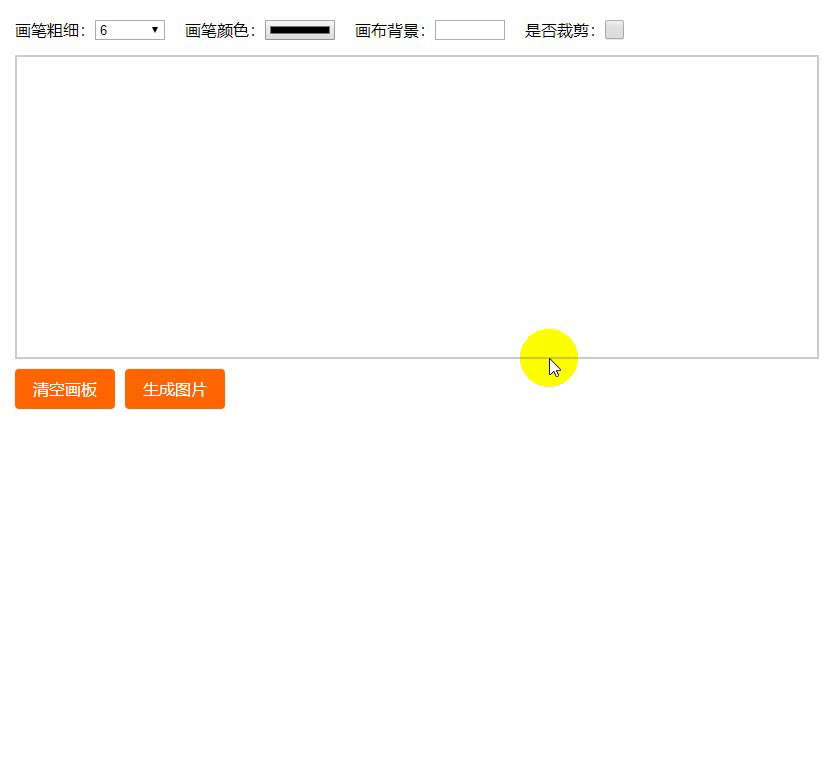

# vue-esign

> Canvas 手写签字 电子签名

 

## 时隔三年的更新！！支持vue3
- **支持vue3！！！！更新依赖后，仅`bgColor`原来的`.sync`修饰符需改为vue3写法`v-model:bgColor`**;
- 新增属性 `isClearBgColor`，默认值`true`， 清空画布时(reset)是否同时清空设置的背景色(bgColor) ；
- 直接`npm install vue-esign@latest --save`即可，对vue2版本无任何影响；
## 功能
1. 兼容 PC 和 Mobile；
2. 画布自适应屏幕大小变化（窗口缩放、屏幕旋转时画布无需重置，自动校正坐标）；
3. 自定义画布尺寸（导出图尺寸），画笔粗细、颜色，画布背景色；
4. 支持裁剪 （针对需求：有的签字需要裁剪掉四周空白）。
5. 导出图片格式为 `base64`；
6. [示例demo](https://jaimecheng.github.io/vue-esign/demo/)

## 安装

``` bash
npm install vue-esign --save
```

## 使用
1. 全局使用 、局部
```js
// 全局 vue2 main.js
import vueEsign from 'vue-esign'
Vue.use(vueEsign)
// 全局vue3 main.js
import { createApp } from 'vue'
import App from './App.vue'
import vueEsign from 'vue-esign'
const app = createApp(App)
app.use(vueEsign)
// 局部
import vueEsign from 'vue-esign'
components: { vueEsign }
```
2. 页面中使用
    **必须设置 `ref` ，用来调用组件的两个内置方法 `reset()` 和 `generate()`**

  无需给组件设置 `style` 的宽高，如果画布的 `width`属性值没超出父元素的样式宽度，则该组件的样式宽度就是画布宽度，超出的话，组件样式宽度则是父元素的100%；  所以只需设置好父元素的宽度即可；
```html
<!-- vue2 -->
<vue-esign ref="esign" :width="800" :height="300" :isCrop="isCrop" :lineWidth="lineWidth" :lineColor="lineColor" :bgColor.sync="bgColor" />
<!-- vue3 -->
<vue-esign ref="esign" :width="800" :height="300" :isCrop="isCrop" :lineWidth="lineWidth" :lineColor="lineColor" v-model:bgColor="bgColor" />

<!-- isClearBgColor为false时，不必再给bgColor加sync修饰符或v-model -->

<button @click="handleReset">清空画板</button>
<button @click="handleGenerate">生成图片</button>
```
```js
data () {
  return {
    lineWidth: 6,
    lineColor: '#000000',
    bgColor: '',
    resultImg: '',
    isCrop: false
  }
},
methods: {
  handleReset () {
    this.$refs.esign.reset()
  },
  handleGenerate () {
    this.$refs.esign.generate().then(res => {
      this.resultImg = res
    }).catch(err => {
      alert(err) // 画布没有签字时会执行这里 'Not Signned'
    })
  }
}
```
3. 说明

| 属性 | 类型 | 默认值 | 说明 |
| :-: | :-- | :-: | :-- |
| width | Number | 800 | 画布宽度，即导出图片的宽度 |
| height | Number | 300 | 画布高度，即导出图片的高度 |
| lineWidth | 4 | Number | 画笔粗细 |
| lineColor | String | #000000 | 画笔颜色 |
| bgColor | String | 空 | 画布背景色，为空时画布背景透明，<br />支持多种格式 '#ccc'，'#E5A1A1'，'rgb(229, 161, 161)'，'rgba(0,0,0,.6)'，'red' |
| isCrop | Boolean | false | 是否裁剪，在画布设定尺寸基础上裁掉四周空白部分 |
| isClearBgColor | Boolean | true | 清空画布时(reset)是否同时清空设置的背景色(bgColor) |
| format | String | image/png | 生成图片格式 image/jpeg(jpg格式下生成的图片透明背景会变黑色请慎用或指定背景色)、 image/webp |
| quality | Number | 1 | 生成图片质量；在指定图片格式为 image/jpeg 或 image/webp的情况下，可以从 0 到 1 的区间内选择图片的质量。如果超出取值范围，将会使用默认值 0.92。其他参数会被忽略。 |

两个内置方法，通过给组件设置 `ref` 调用：

**清空画布**
```js
this.$refs.esign.reset()
```

**生成图片**

```js
// 可选配置参数 ，在未设置format或quality属性时可在生成图片时配置 例如： {format:'image/jpeg', quality: 0.5}
// this.$refs.esign.generate({format:'image/jpeg', quality: 0.5})

this.$refs.esign.generate().then(res => {
  console.log(res) // base64图片
}).catch(err => {
  alert(err) // 画布没有签字时会执行这里 'Not Signned'
})
```


